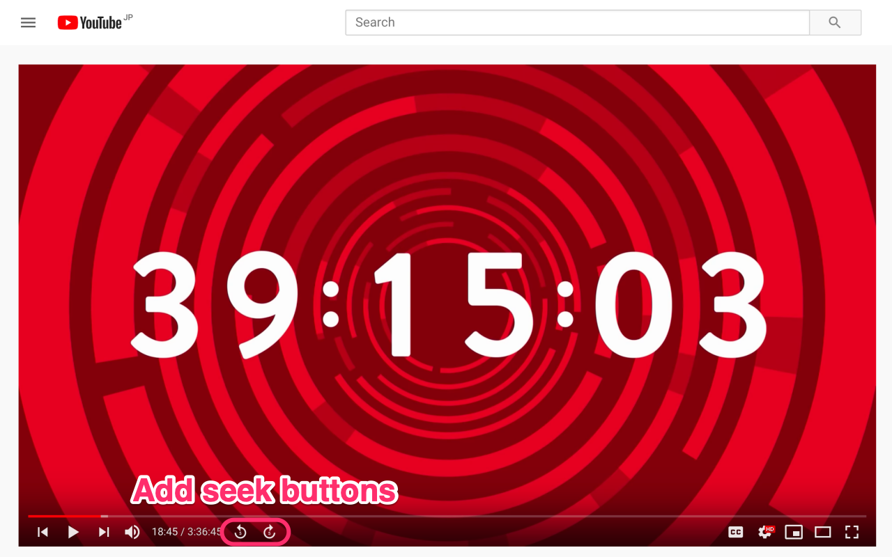

# Player Enhancer for YouTube

[](https://github.com/fiahfy/youtube-player-enhancer/actions/workflows/create-release.yml)

> Chrome Extension for Player Enhancer on YouTube.

## Features

- Add skip controls to the bottom controls.
- Add a reload button to the chat menu.
- Do not scroll when clicking a timestamp.
- Automatically show the chat when closed.
- Automatically close polls in the chat.

## Screenshots




## Installation

1. Download `dist.zip` from [releases page](https://github.com/fiahfy/youtube-player-enhancer/releases) and unzip this file.
2. Open the Extension Management page by navigating to `chrome://extensions`.
3. Enable Developer Mode by clicking the toggle switch next to **Developer mode**.
4. Click the **LOAD UNPACKED** button and select the unpacked directory named `dist`.

## Development

```bash
# install dependencies
yarn

# watch files changed and reload extension
yarn dev
```
